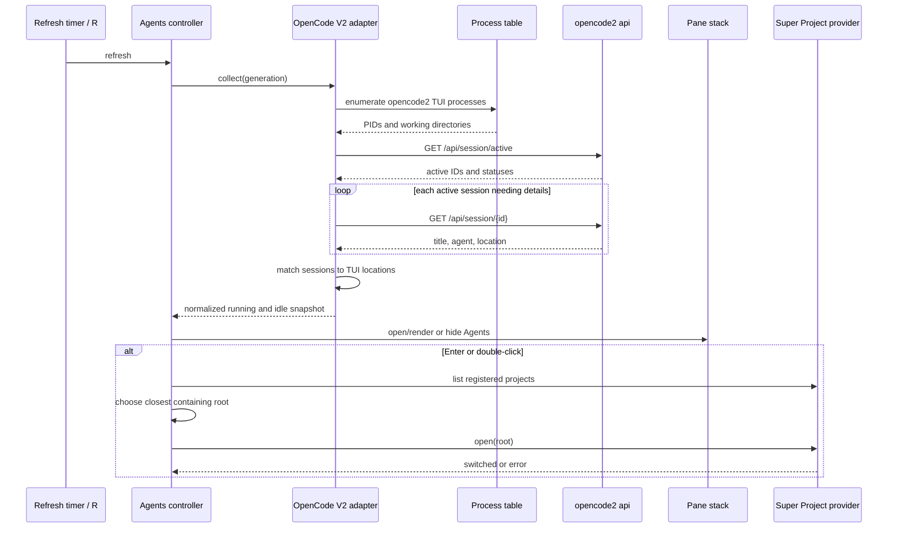

# Design: Add an agents panel

| Created | Updated |
| --- | --- |
| 2026-09-18 | 2026-09-18 |

## Approach

Treat the Agents pane as another dynamic list pane, but isolate runtime-specific
discovery from rendering and project activation. The first adapter speaks to
OpenCode V2 through its `opencode2 api` command; the pane consumes only a small
normalized entry shape and does not know OpenCode response details.

## Analysis

### OpenCode V2 source of truth

The official V2 API provides:

- `GET /api/session/active`: a map from active session ID to `SessionActive`;
- `GET /api/session/{sessionID}`: title, agent, project, and location metadata.

`SessionActive.type` currently has one value, `running`, and the endpoint states
that absent sessions are inactive. It does not expose live TUI clients or map a
client process to its viewed session. The provider will therefore combine two
sources: live full-TUI processes from the current user and active sessions from
the API. It must not reinterpret the full session history as live clients:
every completed session would otherwise look idle forever.

TUI detection enumerates current-user `opencode2` processes and excludes known
non-TUI subcommands (`api`, `run`, `mini`, `serve`, `service`, and other CLI
operations). On Linux, `/proc/<pid>/cwd` supplies the canonical working
directory; systems without `/proc` use `lsof`'s `cwd` record when available.
Each process has stable identity `opencode-tui:<pid>` for its lifetime.

Active sessions and TUI instances are matched one-to-one by canonical working
directory, with containing-directory matching as a fallback. A matched TUI
uses its session's running metadata but retains the process identity. An
unmatched TUI becomes an `idle` entry with an explicit OpenCode TUI description
and unavailable-model fallback. Unmatched active sessions remain visible so
background/API-driven work is not lost.

The adapter will run the supported CLI instead of guessing the background
service URL or authentication. `opencode2 api` performs service discovery and
uses the same connection context as the TUI.

### Normalized entry

The pane needs only these provider-neutral fields:

```lua
{
  id = "provider-stable-id",
  provider = "opencode",
  instance = "tui",
  pid = 122897,
  status = "running",
  title = "Agents panel with status display",
  directory = "/home/user/ws/super-tree.nvim",
  project = "super-tree.nvim",
  agent = "build",
  model = "gpt-5.6-sol",
  model_provider = "opencode",
  model_variant = "max",
}
```

The OpenCode adapter owns response unwrapping, validation, title fallbacks, and
path normalization. Missing agent or model metadata receives a concise fallback
so the third row is never empty. Entries sort by status priority, project,
title, then ID so periodic refreshes do not shuffle equivalent rows.

### Refresh lifecycle

Opening SuperTree starts an immediate refresh and a repeating timer. Only one
refresh generation may run at once. TUI process collection and the
active-session request run asynchronously as one snapshot; session details are
fetched and cached by ID, with periodic revalidation so generated titles and
moved locations eventually update. `R` bypasses the interval and requests fresh
details.

Every callback checks a lifecycle generation before changing state. Closing
SuperTree stops the timer, terminates owned jobs where possible, and invalidates
callbacks. A command timeout prevents a stuck service request from leaving the
refresh permanently in flight. A failed refresh retains the last valid snapshot
until a later success, avoiding pane flicker; it does not manufacture agent
states or block Neovim.

The executable check and failures are quiet during background polling. A manual
refresh may issue one concise warning, but repeated timer failures must not spam
notifications.

### Pane composition

The window module currently hard-codes two optional panes. Add an ordered pane
definition shared by split and floating layouts:

1. Agents
2. Projects
3. Buffers
4. Tree (flexible remainder)

Opening or closing any optional pane preserves the measured heights of every
other pane. Floating layout apportions constrained space in the same order.
Agents automatically opens for a non-empty valid snapshot (including idle TUI
instances) and closes after a successful snapshot with neither TUIs nor active
sessions. Those transitions restore the previously focused window whenever it
remains valid.

Each agent occupies exactly three content rows:

1. `● running  super-tree.nvim` — status icon, status text, and project;
2. `Agents panel with status display` — description from the session title;
3. `build · opencode/gpt-5.6-sol · max` — agent, model provider/name, and
   variant.

The icon and `running` label share a status highlight. The project and
description use primary list text, while agent/model metadata uses the existing
faded-name visual language. Text accompanies color, so state is not
communicated by color alone. Known states receive configurable symbols and
status highlights; an unrecognized value uses a neutral icon/color and displays
its original text.

The renderer maintains a row-to-entry map covering all three rows. Cursor
movement in the Agents pane advances to the first row of the previous or next
agent rather than stepping through an entry's metadata. A mouse click may leave
the cursor on any row, but entry lookup, filtering, selection restoration,
Enter, and double-click resolve through the map so all three rows act as one
item. Header counts continue to count agents, not buffer lines.

### Super Project activation

Agent locations can be nested below a registered project. Activation asks the
registered `super-project` provider for its project list, chooses the longest
root that contains the agent directory, and opens that root. If no registered
root contains it, the exact existing directory is offered to Super Project,
whose public `open` path can register a valid project.

The integration must require the native provider name `super-project`; it must
not silently switch through neovim-project or change `cwd` directly. This keeps
workspace capture, parked terminals, and SuperTree restoration inside Super
Project's transaction.

Agents visibility is live global state, not a per-project preference. Existing
SuperTree state capture will nevertheless record pane height, selected agent
ID, and focused pane. Restore reapplies those values when the selected agent is
still active and otherwise falls back safely.

## Data flow



The important boundary is that the pane never calls OpenCode or changes the
workspace directly; adapters collect data and Super Project owns switching.

## Decisions

- **Processes plus active endpoint over session history.** Processes identify
  live TUI instances; `/api/session/active` identifies running work. Historical
  sessions identify neither reliably.
- **CLI over direct HTTP.** The CLI handles service discovery and connection
  context without duplicating OpenCode internals in Lua.
- **Polling over the volatile event stream.** The event stream can lose events
  during disconnection and still requires reconciliation. A small active-set
  poll is simpler and self-healing for the first provider.
- **Internal provider boundary, not a public registration API yet.** The entry
  contract prevents OpenCode coupling; a stable public API can be designed when
  a second provider supplies real compatibility requirements.
- **Three fixed rows per agent.** Status/project, description, and agent/model
  metadata remain independently scannable like Herdr's information-dense agent
  entries. An explicit row map preserves list semantics despite the multi-line
  rendering.
- **Auto-visible, not manually toggled.** Running work should surface without a
  keybinding and should consume no space when absent. `agents.enable = false`
  is the explicit opt-out.
- **Super Project only for activation.** Direct `cd` and legacy project-manager
  fallbacks would bypass workspace state and terminal preservation.

## Risks

- **Process churn:** repeated CLI launches can be expensive with many agents.
  Use one process-list and one active-set request per interval, cache details,
  refresh metadata less frequently, and prohibit overlapping polls.
- **Imperfect client/session association:** OpenCode V2 exposes no client ID on
  active sessions. Pair canonical directories one-to-one, retain PID identity,
  and keep both unmatched TUIs and unmatched sessions visible rather than
  dropping data.
- **Late callbacks after close or project switch:** generation checks and owned
  job cleanup prevent stale rendering.
- **Dynamic pane regressions:** adding a third pane touches ordering and height
  logic in every window mode. Generalize around one ordered list and extend the
  existing layout tests instead of adding more pairwise branches.
- **Multi-row selection drift:** native line motion could land on metadata and
  make filtering or activation address the wrong entry. Keep a row-to-entry
  map, use entry-wise motion, and test actions from every row.
- **Nested locations:** exact-directory switching can create unintended nested
  projects. Longest registered-root matching avoids that when Super Project
  already knows the workspace.
- **API evolution:** strict decoding could hide all entries after an additive
  status change. Validate required identity/location fields, preserve unknown
  status text, and ignore unrelated response fields.
- **Transient service failures:** retaining the last successful snapshot avoids
  UI flicker but can briefly show stale activity. A later successful empty
  snapshot is authoritative and closes the pane.

## Change history

| Date | Change |
| --- | --- |
| 2026-09-18 | Initial design |
| 2026-09-18 | Changed agent presentation to three selectable content rows |
| 2026-09-18 | Added live TUI detection and idle-instance reconciliation |
