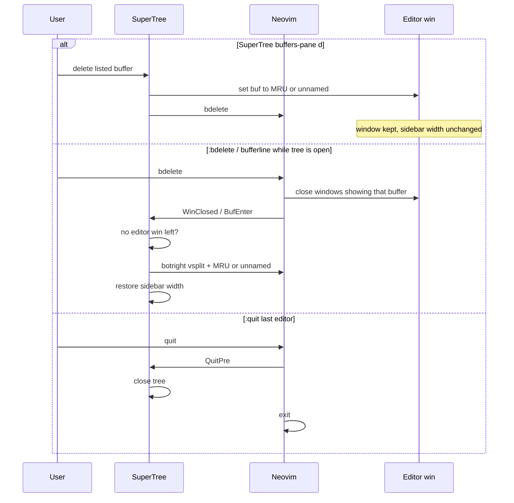
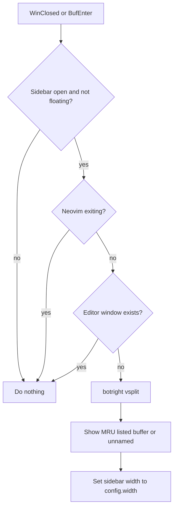

# Design: Preserve an editor window when a buffer is closed

| Created | Updated |
| --- | --- |
| 2026-09-06 | 2026-09-06 |

## Approach

Treat “SuperTree plus at least one editor” as an invariant while the tree is open as a split. When a buffer goes away, move editor windows to the MRU listed buffer (or a new unnamed listed buffer) instead of letting Neovim close those windows and stretch the tree.

## Analysis

### Why the tree fills the tab

`:help :bdelete`:

> Any windows for this buffer are closed.

If the deleted buffer is not the current buffer (buffers-pane `d`, bufferline close while the tree is focused, `:bd N` from another window), Neovim closes every window that was showing it. SuperTree still exists, so this is not “the last window” and Neovim does not create an empty editor. The tree expands to 100% width.

If the deleted buffer *is* current and other listed buffers exist, Neovim keeps the window and shows a jumplist entry. Layout survives; replacement may not be MRU. If it is the last listed buffer, Neovim empties the buffer in place. Those two cases are already acceptable for layout.

The reported `E444` stack (`:SuperTree` → `close` → `nvim_win_close`) is the follow-on: after the tree is the only window, toggle cannot close it.

Opening a file from that state uses `rightbelow vertical split` from the tree window. That splits only the tree row (wrong if the buffers pane is stacked above it) and does not reset width, so the new buffer looks full-screen or 50/50 rather than a sidebar plus editor.

### Why `BufDelete` cannot prevent the close

`BufDelete` runs after windows have already been closed or switched. SuperTree cannot reliably unshow inside that autocmd. Builtin `:bdelete` is C code and is not wrapped.

So:

- SuperTree-owned deletes unshow first (same algorithm as mini.bufremove).
- All other deletes are repaired by the layout invariant as soon as no editor window remains.

### Quit vs delete

`QuitPre` already closes SuperTree when the last editor window is quitting, so Neovim can exit. That runs *before* the editor window is gone, so `close_window` is not closing the last window.

`WinClosed` recovery must not fight that path: if `QuitPre` already closed SuperTree, `is_open()` is false. Also skip when `vim.v.exiting` is set.

### Replacement buffer

MRU: `getbufinfo({ buflisted = 1 })`, exclude the buffer being removed and SuperTree/SuperTreeFilter, keep `buftype == ""` or `"acwrite"`, pick highest `lastused`.

If none: `nvim_create_buf(true, false)` — listed, not scratch-`nofile`, unnamed so `[No Name]` and `|buffer-reuse|` apply.

### Creating an editor beside the tree

Do not `rightbelow vertical split` from the tree window. With the buffers pane stacked above the tree, that only splits the tree row:

```
buffers |        (missing)
tree    | editor
```

Use `botright vsplit` so the editor is full height, then `nvim_win_set_width(sidebar_win, width)`.

## Decisions

- **Invariant over wrapping `:bd`.** Recover when the tree would be alone. Do not replace the global `:bdelete` command.
- **MRU over alternate/jumplist** for SuperTree-owned replacement and for newly created editor windows. Matches the requested behavior; differs from mini.bufremove’s `#` / `:bprevious`.
- **Unnamed listed, not `buftype=nofile`.** Users expect a normal empty buffer.
- **`pcall` on last-window close** in addition to creating an editor first, so toggle never surfaces `E444`.
- **Floating mode unchanged** for this invariant (overlay, not a split).

## Risks

- `WinClosed` + `vim.schedule` can race with quit. Guard with `is_open()`, `find_editor_win()`, and `vim.v.exiting`.
- `BufEnter` nested safety net must not create a second editor; `ensure_editor_win` is idempotent.
- `guard_window` and `ensure_editor_win` both creating splits: both go through the same helper.
- Briefly showing the tree buffer in a new `vsplit` before `win_set_buf` must not trip `guard_window` (guard only acts when the *sidebar window* receives a foreign buffer).

## Visuals

Buffer close while the tree is a split. The important split is “unshow first” vs “window already gone”:



Layout invariant after a window closes:



## Change history

| Date | Change |
| --- | --- |
| 2026-09-06 | Initial design |
