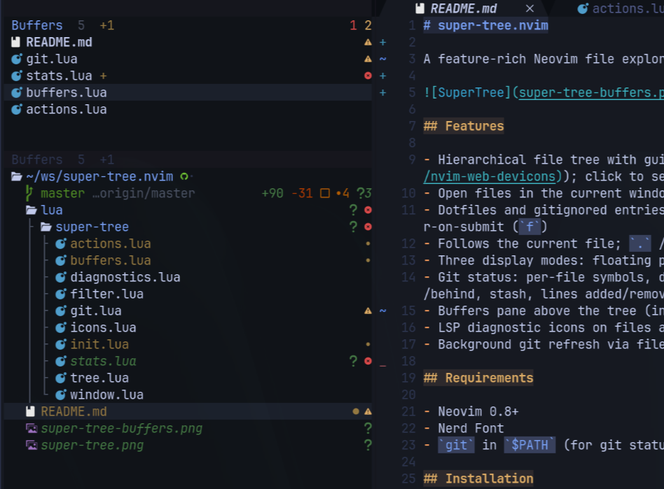

# super-tree.nvim

A feature-rich Neovim file explorer with multi-repo git support, file operations and more.



## Features

- Hierarchical file tree with guide lines, folder icons, and file-type icons (builtin or [nvim-web-devicons](https://github.com/nvim-tree/nvim-web-devicons)); click to select, double-click to open
- Open files in the current window, splits, or tabs; create, rename, delete, move, copy, and clipboard cut/paste
- Live filter (`/`), directory finder (`D`), fuzzy sorter (`#`), filter-on-submit (`f`); `H` toggles hiding of dotfiles and gitignored entries
- Follows the current file; `.` / `<BS>` change the tree root
- Three display modes: floating popup, pinned split, or persistent sidebar
- Git status: per-file symbols, directory bubbling, multi-repo branch summaries, and a detailed root status line (branch, ahead/behind, stash, lines added/removed)
- Buffers pane above the tree (independently scrollable and resizable; `B` to toggle)
- Projects pane above Buffers when [neovim-project](https://github.com/coffebar/neovim-project) has projects available; select a project to switch sessions
- LSP diagnostic icons on files and directories (bubbled to parents)
- Background git refresh via filesystem watchers

## Requirements

- Neovim 0.8+
- Nerd Font
- `git` in `$PATH` (for git status)

## Installation

### lazy.nvim

```lua
return { "keathmilligan/super-tree.nvim", opts = {} }
```

### packer.nvim

```lua
use { "keathmilligan/super-tree.nvim", config = function()
  require("super-tree").setup()
end }
```

### vim-plug

```vim
Plug 'keathmilligan/super-tree.nvim'
```

Then `require("super-tree").setup()`.

## Commands

| Command | Description |
|---------|-------------|
| `:SuperTree` | Toggle |
| `:SuperTreeOpen` | Open |
| `:SuperTreeClose` | Close |
| `:SuperTreeFocus` | Focus (opens if closed) |
| `:SuperTreeReveal` | Reveal the current file |

Bind the toggle globally (for example to `\`):

```lua
vim.keymap.set("n", "\\", function()
  require("super-tree").toggle()
end, { desc = "SuperTree" })
```

With lazy.nvim:

```lua
return {
  "keathmilligan/super-tree.nvim",
  keys = { { "\\", "<cmd>SuperTree<cr>", desc = "SuperTree" } },
  opts = {},
}
```

## Keybindings

Neo-tree filesystem defaults where practical. Editing keys are disabled.

| Key | Action |
|-----|--------|
| `j` / `k` / arrows | Move |
| `<Enter>` / double-click | Toggle directory / open file / switch project (Projects pane) |
| `l` / `<Right>` | Expand / open |
| `h` / `<Left>` | Collapse / jump to parent |
| `S` / `s` / `t` | Open in split / vsplit / tab |
| `<Tab>` | Jump to editor |
| `<C-w>` … | Window commands |
| `.` / `<BS>` | Set root / root up |
| `z` | Collapse all |
| `a` / `A` | Add file / directory |
| `d` / `r` / `m` / `c` | Delete / rename / move / copy |
| `y` / `x` / `p` | Clipboard copy / cut / paste |
| `H` | Toggle hidden |
| `/` | Live filter (tree, buffers, or projects pane; Enter opens, Esc clears) |
| `D` | Filter directories |
| `#` | Fuzzy sorter |
| `f` | Filter on submit |
| `<C-x>` | Clear filter |
| `B` | Toggle buffers pane |
| `R` | Refresh |
| `?` | Help |
| `q` | Close |
| `<Esc>` | Close (floating and pinned only) |

## Configuration

```lua
require("super-tree").setup({
  width = 50,
  mode = "sidebar", -- "floating", "pinned", or "sidebar"
  icons = {
    enable = true,
    provider = "auto", -- "auto", "nvim-web-devicons", or "builtin"
  },
  follow_current_file = true,
  open_files_do_not_replace_types = { "terminal", "Trouble", "qf", "edgy" },
  filtered_items = {
    hide_dotfiles = false,
    hide_gitignored = false,
  },
  filter = {
    search_limit = 50,
    find_by_full_path_words = false,
  },
  buffers = {
    enable = true,
    height = 8,
  },
  projects = {
    enable = true, -- automatically shown when neovim-project has projects
    height = 20,
  },
  diagnostics = {
    enable = true,
    -- symbols = { error = "E", warn = "W", info = "I", hint = "H" },
  },
  fade = {
    enable = true,
    zone = 0.3,            -- last fraction of pane height that fades
    bottom_opacity = 0.25, -- item on the bottom row of the pane
  },
  git = {
    enable = true,
    multiline = true, -- two-line layout for git workspaces in the tree
    max_jobs = 4, -- concurrent background `git` processes (shared pool)
    status = {
      enable = true,
      show_remote = false, -- upstream ref next to the branch name
      symbols = {
        added = "", deleted = "", modified = "", renamed = "󰁕",
        untracked = "", ignored = "", staged = "", unstaged = "󰄱",
        conflict = "", branch = "", ahead = "", behind = "",
        clean = "", stash = "≡", lines_added = "+", lines_removed = "-",
      },
    },
  },
})
```

### Projects

Automatically appears above Buffers (or above the tree when Buffers is hidden) when [neovim-project](https://github.com/coffebar/neovim-project) is configured and discovers projects. Uses its project patterns and exclusions. Sorted by last used (current project first, then neovim-project history, newest first). Missing directories are omitted; `R` refreshes the list.

`<Enter>`, double-click, or `l` switches to the selected project through neovim-project, including its session save/load behavior. SuperTree reopens after the switch. The active project is marked with `>`; paths distinguish projects with the same name. `/` live-filters the list by name or path. Navigate between panes with `<C-w>k` / `<C-w>j`, and resize split panes with `<C-w>+/-` or the mouse.

Set `projects.enable = false` to disable, or `projects.height` to change the initial height (default 20). Without neovim-project or available projects, the pane stays hidden.

### Buffers

On by default (`buffers.enable = false` to disable). Press `B` to toggle. The pane is a real window above the tree (`<C-w>k` / `<C-w>j` to move, resize with `<C-w>+/-` or the mouse). The current buffer is marked with `>` and highlighted like the active project. `/` live-filters the list by name or path. `<Enter>` opens, `d` deletes the buffer (the editor window stays and shows the most recently used buffer, or a new unnamed buffer if none remain).

### Fade

The bottom of each pane darkens based on **window height**, not how many items are in the list. A short list in a tall pane stays full strength. Disable with `fade.enable = false`. `fade.zone` is the last fraction of the pane that fades (default `0.3`). `fade.bottom_opacity` is the opacity of an item sitting on the bottom row (default `0.25`).

### Diagnostics

Right-aligned signs on files with LSP diagnostics (same text as the gutter: `vim.diagnostic.config().signs`, or `E`/`W`/`I`/`H`). Directories show the highest-severity child. Override with `diagnostics.symbols`. Disable with `diagnostics.enable = false`.

### Filter

`/` live-filters the focused pane. In the tree, that is a substring match on names (50 hits); / move while typing; Enter opens the focused node and clears; Esc clears. In Projects or Buffers, `/` filters that list by name or path with the same keys (`#` fuzzy-ranks, `f` waits for Enter, `<C-x>` clears). `D` is tree directories only. `find_by_full_path_words` matches tree hits against the relative path instead of the filename.

### Modes

- **sidebar** (default): persistent split; stays open when files are opened; only `q` closes; quitting the last editor window closes it too. Closing a buffer keeps the sidebar and shows the most recently used buffer, or a new unnamed buffer if none remain. Toggling the tree closed never leaves Neovim without a window.
- **floating**: overlay; `q` / `<Esc>` close
- **pinned**: split; `q` / `<Esc>` close. Closing a buffer keeps the split and shows the most recently used buffer, or a new unnamed buffer if none remain.

### Git status

Right-aligned virtual text in muted colors:

- **Files**: porcelain symbol; name tinted to match
- **Directories**: highest-priority child status (conflict > untracked > modified > added > deleted > renamed)
- **Repos** (`git.multiline = true`, default): two lines like the cwd root — name on the first, branch/ahead/behind/stash on the left of the second, line diffstat and change breakdowns on the right. Set `multiline = false` for a single-line compact summary. Set `git.status.show_remote = true` to include the upstream ref next to the branch.

Refreshed in the background from directory watchers, git-dir watchers, and `BufWritePost`. Git processes share a pool (`git.max_jobs`, default 4) so a folder of many repositories cannot spawn unbounded jobs; a 15s timeout keeps a huge worktree from stalling the pool. Only expanded directories are scanned, and filesystem watches are updated incrementally (capped) rather than torn down on every refresh.

### Appearance

Sidebar background is darkened from `Normal` and re-derived on `:colorscheme`. Override `SuperTreeNormal` (also `SuperTreeNormalNC`, `SuperTreeEndOfBuffer`, `SuperTreeCursorLine`, `SuperTreeWinSeparator`).

Git highlight groups: `SuperTreeGitAdded`, `SuperTreeGitDeleted`, `SuperTreeGitModified`, `SuperTreeGitRenamed`, `SuperTreeGitStaged`, `SuperTreeGitUnstaged`, `SuperTreeGitUntracked`, `SuperTreeGitIgnored`, `SuperTreeGitConflict`, `SuperTreeGitBranch`, `SuperTreeGitAheadBehind`, `SuperTreeGitClean`. Active project and buffer names use `SuperTreeProjectsCurrent` and `SuperTreeBuffersCurrent` (Special, bold).

### Icons

`icons.provider`: `"auto"` (nvim-web-devicons if present, else builtin), `"nvim-web-devicons"`, or `"builtin"` (30+ types, no dependencies).

### Bufferline

```lua
require("bufferline").setup({
  options = {
    offsets = {
      { filetype = "SuperTree", text = "SuperTree", highlight = "Directory", separator = true },
    },
  },
})
```

The plugin fires `User SuperTreeOpen` / `SuperTreeClose` and redraws the tabline.

## Limitations

No persistent state across sessions. Mouse clicks require `mouse` to include normal mode (e.g. `set mouse=a`).

## License

MIT
